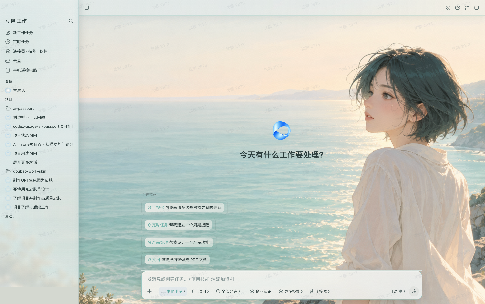
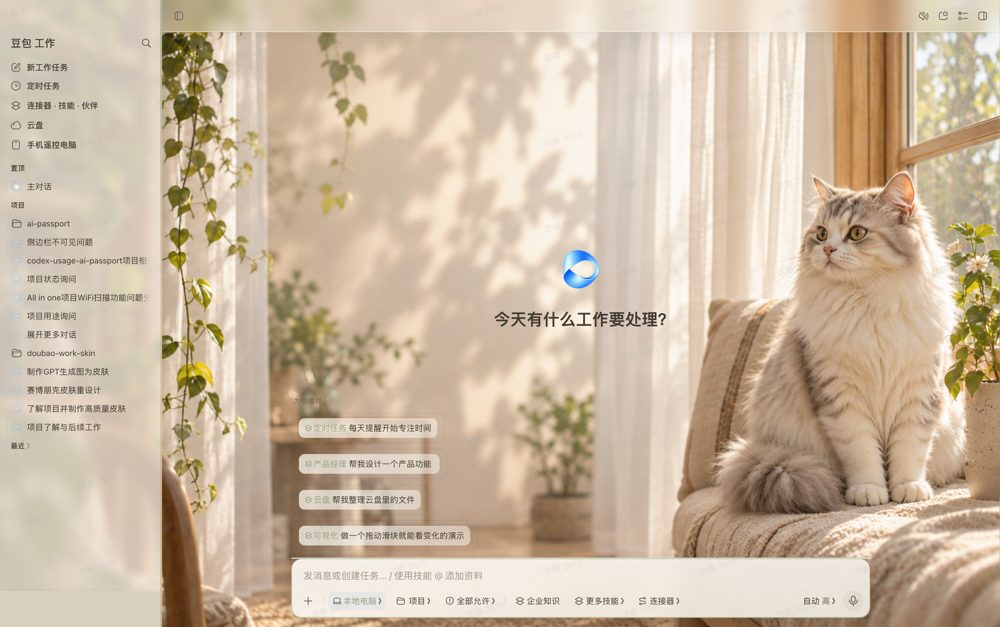
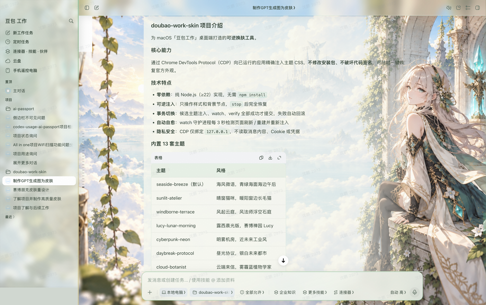
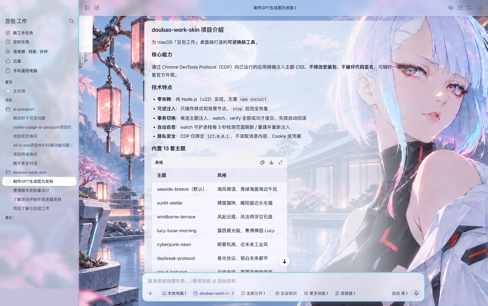

# Doubao Work Skin

为 macOS「豆包工作」桌面端提供 13 套皮肤，支持通过 Agent 切换和定制。输入框发送按钮等控件自动适配各主题强调色。主题以临时样式注入，不修改应用安装包，可恢复官方外观。


## 快速开始

需要 **macOS 13.5 或更新版本**（Apple 芯片或 Intel），豆包工作安装在 `/Applications/DoubaoWork.app`。安装器会自动准备专用运行环境，无需预先安装 Node.js、Git 或 Homebrew。

将下面这段话发送给能够操作本机的豆包工作：

> 请根据 https://github.com/superShen0916/doubao-work-skin 的 README 和 AGENTS.md，帮我安装并启用豆包换肤，换成「晴窗猫咪」。已经安装就直接复用；如果需要重启，请告诉我操作步骤，应用后验证是否生效。

项目提供 [Agent 操作指南](./AGENTS.md)，涵盖下载、安装、切换和验证。Agent 需要能够访问仓库并在你的 Mac 上执行命令；对话安装目前处于实验阶段，仍需在豆包工作中验证完整流程。首次启用可能需要按提示手动重启应用。

## 效果预览

| 海风微语                                    | 晴窗猫咪                                    | 风起云庭                                       | 露西晨光版                                        |
| --------------------------------------- | --------------------------------------- | ------------------------------------------ | -------------------------------------------- |
|  |  |  |  |

更多主题见[内置主题](#内置主题)。

## 安装与日常使用

首次启用可能需要重启豆包工作。安装完成后，按提示保存工作，等待当前任务结束，再从 **启动台** 或 **应用程序** 文件夹打开「豆包换肤」App（安装时自动创建到 `~/Applications/豆包换肤.app`，可拖到 Dock）。App 会智能判断：应用未运行时直接启动带皮肤；启动成功后激活窗口；已运行但启动失败时自动重试一次，并在需要时直接重启，无需确认。重新打开后回到原对话继续换肤。

也可以双击桌面“豆包换肤”文件夹中的 **`启动豆包工作.command`**（需要重启时会询问确认）。以后通过 App 或桌面入口启动应用，都会使用上次成功应用的皮肤。在已建立上下文的对话中，可以直接说：

- “换成海风微语。”
- “有哪些皮肤？”
- “用这张图片制作一套皮肤。”
- “恢复官方外观。”

新对话需要提供工具位置时，双击桌面文件夹中的 **`复制换肤提示词.command`**，将复制的内容粘贴到对话中即可。

### 手动安装

1. 从 [GitHub Releases](https://github.com/superShen0916/doubao-work-skin/releases) 下载 `DoubaoWorkSkin-<版本>-macos-scripts.zip`，或下载本仓库源码 ZIP，完整解压。
2. 双击 **`安装皮肤.command`**，等待安装完成。首次安装需要联网，安装过程不会退出豆包工作。
3. 从启动台打开「豆包换肤」App，或双击桌面“豆包换肤”文件夹中的 **`启动豆包工作.command`**。App 无需确认，会自动处理重启；`.command` 方式需要重启时会询问确认。

首次启动默认使用「海风微语」。安装完成后，原始下载目录可以移动或删除。macOS 或公司设备策略可能要求额外确认或限制脚本运行。

若桌面入口未创建成功，可在 Finder 中选择“前往 → 前往文件夹”，打开 `~/Library/Application Support/DoubaoWorkSkin/启动入口/`。这里有相同的启动、恢复和复制提示词文件。启动 App 位于 `~/Applications/豆包换肤.app`。

### 可选：Skill

支持导入本地 Skill 的客户端可从 [GitHub Releases](https://github.com/superShen0916/doubao-work-skin/releases) 下载并导入完整的 `doubao-work-skin-<版本>-skill.zip`，其中包含操作说明、安装脚本和皮肤资源。Skill 不是安装前提，其导入与触发能力取决于客户端，目前尚待豆包工作实测。

[Skill 源文件](./skills/doubao-work-skin/SKILL.md)用于维护；源码中的这个目录只有入口，`assets/project/` 在打包时自动加入 ZIP。不要把源码技能目录当成完整安装包：单独复制它仍需 Agent 联网下载程序。打包方式见[发布指南](./RELEASING.md)。

## 内置主题

| 主题 ID                 | 主题    | 风格                    |
| --------------------- | ----- | --------------------- |
| `seaside-breeze`      | 海风微语  | 青绿海面与暖白天空的海边午后        |
| `sunlit-atelier`      | 晴窗猫咪  | 暖阳窗边的银白长毛猫写实摄影        |
| `windborne-terrace`   | 风起云庭  | 风法师与浮空石庭的奇幻插画         |
| `lucy-lunar-morning`  | 露西晨光版 | 赛博禅园与 Lucy 肖像主视觉      |
| `daybreak-protocol`   | 昼光协议  | 银白未来都市与青蓝结构玻璃         |
| `cyberpunk-neon`      | 明雾机房  | 明亮克制的近未来工业风           |
| `cloud-botanist`      | 云端来信  | 雾霾蓝天空下的植物学家与温室花架      |
| `porcelain-cat-moon`  | 月白庭院  | 杏色陶瓷拱门与象牙白瓷猫          |
| `washi-crane-mist`    | 纸上云汀  | 和纸仙鹤与折纸山峦的东方意境        |
| `opaline-observatory` | 虹光观测站 | 乳白玻璃与冰川青的未来观测站        |
| `citrus-garden`       | 橘园午后  | Risograph 印刷风的柑橘树与陶土盆 |
| `cloud-whale`         | 浮鲸之境  | 珍珠白天空中浮游的小鲸           |
| `golden-hour`         | 黄金时刻  | 紫袍英雄与戏剧性光影            |

## 自定义主题

把喜欢的图片和想法交给 Agent，就可以制作自己的皮肤。你只需要描述想要的效果，图片搭配、颜色调整和皮肤制作交给 Agent 完成。

完成安装后，在换肤对话中发送图片或描述即可。新对话可通过“复制换肤提示词.command”提供工具位置。

### 用自己的图片做皮肤

上传一张喜欢的照片、壁纸或插画，然后说：

> 用这张图片做一套「我的花园」皮肤，颜色柔和一点，主体靠右，聊天文字要清楚。做好后帮我应用。

### 描述你想要的风格

也可以先说出喜欢的颜色、场景和氛围，让 Agent 帮你设计：

> 做一套雨天咖啡馆皮肤，暖棕色，窗外有雨，聊天区域保持明亮。

背景生成需要 Agent 具备图像生成能力；不支持时，可以提供自己的图片。

### 边用边调整

看到效果后，继续用自然语言提出修改即可：

- “背景再淡一点，文字更清楚一些。”
- “人物往右挪，别挡住聊天内容。”
- “按钮换成更柔和的绿色。”
- “先帮我切回晴窗猫咪。”

安装版的新皮肤保留在 `~/Library/Application Support/DoubaoWorkSkin/skins/`，更新程序时不会覆盖；源码版保留在项目的 `skins/` 中。以后可以让 Agent 按名称切换。

制作规范见 [Agent 操作说明](./AGENTS.md#创建与调整自定义皮肤)。

### 自定义 App 图标

想换「豆包换肤」启动器的图标？右键 `~/Applications/豆包换肤.app` → 显示简介，把喜欢的图片拖到简介窗口左上角的小图标上即可，不用重新安装。

## 从源码运行

面向开发者，需要 Node.js ≥ 22，无第三方运行依赖，无需 `npm install`。以下命令适用于完整源码仓库；脚本发布包和 Skill 包用于安装，不包含完整开发工具。下载并解压源码后，在项目目录执行：

```sh
npm start
```

应用未运行时会自动启动；已开启调试接口时直接复用。若应用正在运行且未开启调试接口，请保存工作并完全退出，再执行上述命令。也可在外部终端执行 `npm start -- --force` 允许重启；运行在豆包工作中的 Agent 不应通过此命令重启自身宿主。

首次使用「海风微语」，以后使用上次成功的主题。指定主题可用 `npm start -- sunlit-atelier`。成功后可关闭终端，后台进程会继续保持皮肤；`npm stop` 停止注入并恢复外观。

### 命令参考

```sh
node skin.mjs start [theme]     # 启动并应用主题（记住上次选择，首次 seaside-breeze）
node skin.mjs switch <theme>    # 运行中切换主题（带回滚）
node skin.mjs list              # 列出可用主题与当前状态
node skin.mjs status            # 查看记录的状态与 watch 进程（JSON）
node skin.mjs verify            # 校验当前主题是否真实注入
node skin.mjs stop              # 停止守护并恢复官方外观
node skin.mjs restore           # 停止守护、恢复外观并清除状态
```

* 从 Dock/Finder 正常重新打开应用不会保留 CDP 参数。旧 watch 进程仍在不代表新应用已开启 CDP。

* 重启会等待主应用和独立浏览器进程退出；若浏览器迟迟不退出，会报出 PID 并中止，避免旧实例忽略新的调试参数。

* `--port N` 设置首选 CDP 端口（默认 9342）；启动会复用发现的 CDP 或尝试后续 5 个端口，实际端口以启动输出和状态记录为准

* `node skin.mjs stop --keep-appearance` 只停止 watch，保留当前页面外观；刷新或退出后皮肤不会自动恢复

* 状态与日志保存在 `~/Library/Application Support/DoubaoWorkSkin/`

## 工作原理

```
最终 CSS = 主题变量(:root) + src/base.css + 可选 skins/<name>/skin.css
```

1. 以 `--remote-debugging-port` 启动（或复用已带 CDP 的）豆包工作

2. 注入器组装主题变量、共享结构 CSS 与主题专属 CSS，通过 CDP 注入

3. 背景图内联为 base64，在聊天主布局中通过可清理的独立 `` 节点承载

4. CDP 可用时，watch 进程每 3 秒检查并恢复页面皮肤；它不会替用户重新启动应用或开启 CDP

5. `stop` 时先停止 watch，再恢复页面；关闭调试端口仍需完全退出应用

6. 所有换肤注入节点、全局对象与属性都有对应的 restore 清理路径

## 常见问题

**重新打开豆包工作后，皮肤为什么消失了？**

从 Dock 或 Finder 普通启动不会保留换肤所需的调试参数。请保存工作，使用「豆包换肤」App（`~/Applications/豆包换肤.app`）或桌面“豆包换肤”中的启动入口启动。App 会自动处理重启，无需确认；`.command` 方式需要重启时会询问。源码用户可使用 `npm start`。后台进程存在不代表当前窗口的皮肤已生效，Agent 需通过 `verify` 检查。

**主题异常或页面无响应怎么办？**

优先使用桌面“恢复官方外观.command”。如果恢复失败，请保存工作后完全退出豆包工作，再正常打开；完全退出会清除临时样式。源码用户可用 `npm stop -- --keep-appearance` 停止残留后台进程，再退出应用。应用升级后出现兼容性问题，可按[贡献指南](./CONTRIBUTING.md)提供版本与复现步骤。

**如何更新？**

从 [最新正式版](https://github.com/superShen0916/doubao-work-skin/releases/latest) 下载完整包并重新运行安装脚本，或请 Agent 更新。个人皮肤和上次选择会保留，已有背景、配色和主题专属样式文件不会被覆盖。

从 v2.2.2 起，程序在加载主题时自动兼容旧内置主题及其个人副本中的状态条和菜单规则，修复输入框多余边框及子菜单裁剪；无需手工修改 `skin.css`。这不代表所有未来的主题设计变化都会自动同步。更新完成后，通过「豆包换肤」App 或桌面入口启动，或让 Agent 重新应用皮肤并验证。GitHub 发布新版不会自动更新本机安装。

**如何恢复和卸载？**

双击桌面“恢复官方外观.command”即可停止注入并恢复外观；关闭调试接口还需完全退出应用。卸载时先恢复并退出，备份个人皮肤，再删除 `~/Library/Application Support/DoubaoWorkSkin/`、桌面快捷文件夹和 `~/Applications/豆包换肤.app`。

源码用户应先在原项目目录执行 `npm stop`；应用已退出或 CDP 不可用时，使用 `npm stop -- --keep-appearance` 停止残留后台进程。确认进程已停止后，再删除项目及上述用户数据目录。

**支持 Windows 或 Linux 吗？**

暂不支持，目前仅适配 macOS 桌面端。

## 开发与贡献

```sh
npm run check   # 语法、JSON、主题配置与资源检查
npm test        # 行为与失败路径回归测试
```

CI 使用 macOS + Node.js 22 / 24，测试不连接真实应用。

| 文档 | 用途 |
| --- | --- |
| [AGENTS.md](./AGENTS.md) | Agent 安装、切换、定制与恢复的操作规范 |
| [CONTRIBUTING.md](./CONTRIBUTING.md) | 开发、主题贡献及测试要求 |
| [RELEASING.md](./RELEASING.md) | 维护者打包、分发及发布验收 |
| [SECURITY.md](./SECURITY.md) | 调试接口、数据处理和漏洞报告 |

`skills/` 保存可选 Skill 入口；`dist/` 是打包输出，`.build/` 可用于本地构建缓存。后两者不属于源码，已被 Git 忽略。

## 安全与隐私

换肤通过本机调试接口（CDP）完成，连接前核对进程归属，注入前检查豆包工作内置页面与聊天布局。常规换肤不读取聊天内容、Cookie 或凭据，无遥测或上传逻辑；首次安装需要下载运行环境。

调试接口具有控制应用的能力；恢复外观不会关闭该接口，完全退出应用才会关闭。请仅使用可信主题。详细边界及问题报告方式见[安全说明](./SECURITY.md)。

## 素材说明

内置 13 套皮肤的背景图由项目维护者使用 GPT 生成。AI 生成来源不代表对图中可能涉及的第三方角色、商标或参考素材的授权；项目的 MIT 许可不授予这些第三方权利。

## 免责声明

本项目为第三方非官方工具，与豆包工作官方无关。应用界面版权归相应权利人所有。因使用本工具产生的后果由使用者自行承担。

## License

[MIT](./LICENSE)
